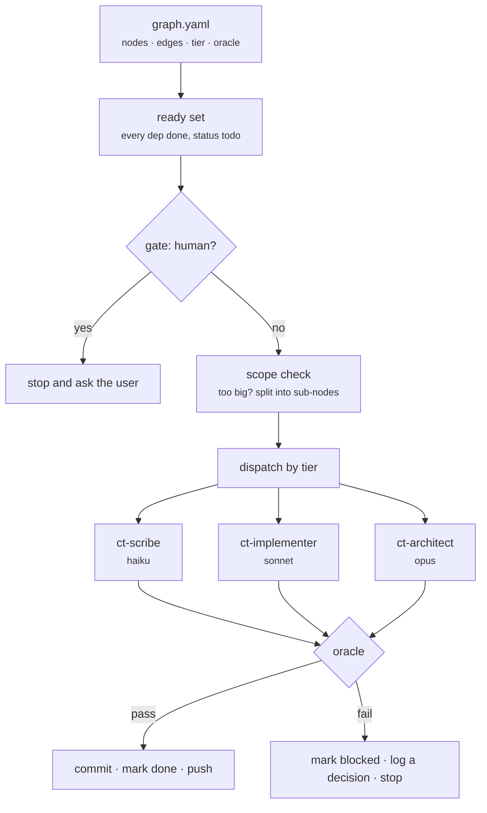
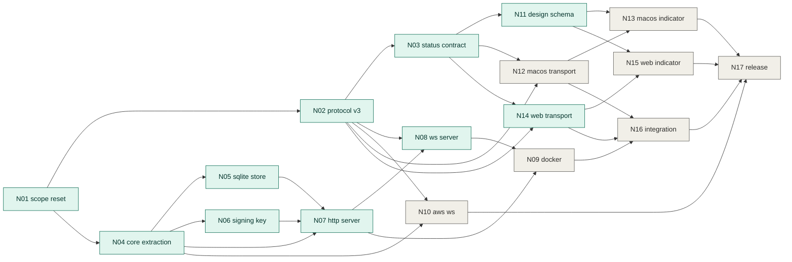

# How this plan works — graph engineering, explained

`README.md` says *what* v0.3.0 is. This file explains *why the plan has this
shape*, what every piece of vocabulary means, and how to apply the same method
to other work. Read it once; you shouldn't need it again.

For the opposite approach — the same release driven as a loop — see
[`experiments/loop-engineering/`](../../experiments/loop-engineering/README.md).
That folder is a reference point, not a live plan.

---

## 1. The idea in one paragraph

A linear plan assumes each step starts when the one before it finished. Most
real releases aren't linear: v0.3.0 has two backend runtimes and two client
platforms that don't depend on each other at all. **Graph engineering records
the actual dependency edges instead of an invented order**, so anything whose
prerequisites are met is legal to start now. That single change is what makes
the work parallelisable, resumable after an interruption, and safe to run
unattended.

## 2. Vocabulary

| Term | What it is | Why it exists |
|---|---|---|
| **Node** | one unit of work, one file in `nodes/` | An executor reads one node plus the graph — never the whole plan. Per-node context cost stays flat as the plan grows. |
| **Edge** (`deps`) | "this can't start until that is done" | The only thing that determines order. Everything else is free to run in any order, including at the same time. |
| **Oracle** | the command that decides *done* | The most important piece. The agent is never its own judge — a compiler or a test suite is. |
| **Gate** (`gate: human`) | a node an unattended agent must not attempt | Declared *before* work starts. Deciding mid-run "should I ask?" is exactly the judgement an autonomous agent is worst at. |
| **Tier** (`model`) | which model the node is worth | Cost control. Dispatch becomes a lookup instead of a guess. |
| **Status** | `todo` / `done` / `blocked` | The only mutable state. Readiness is *computed* from it, so resuming is a calculation, not an act of interpretation. |
| **Decision** | an entry in `decisions.md` | A question only a human can answer, naming the nodes it blocks. |

### The oracle is the load-bearing idea

Everything else is bookkeeping. An oracle is a command anyone can run that
returns pass or fail:

```yaml
- id: N05
  title: SQLite Store implementation
  deps: [N04]
  model: sonnet
  oracle: "cd backend/core && CT_STORE=sqlite npm test"
  status: done
```

That oracle says something stronger than "SQLite store implemented": *the same
suites that pass against the in-memory store pass against SQLite, unmodified*.
Written that way, the node cannot be satisfied by plausible-looking code.

Two rules keep it honest, both encoded in the executor skill:

- **Never edit an oracle to make it green.** If an oracle is genuinely
  mis-specified, a human changes it and says so out loud. (This happened once:
  N01's original oracle couldn't distinguish "specifies the abandoned FPP
  design" from "records that it was abandoned", so it was replaced with
  `scripts/check-arch-doc.sh`, which exempts blockquotes.)
- **Never mark a node done without its oracle passing in the main worktree.**
  The subagent's own report doesn't count.

**A unit of work with no runnable oracle is not a node.** Fold it into one that
has an oracle, or make it a `gate: human` node.

## 3. One pass of the executor



One node per pass, then stop. The value comes from re-orienting against reality
at each boundary, and that only happens if the pass ends.

The full procedure lives in
[`.claude/skills/v030-build/SKILL.md`](../../.claude/skills/v030-build/SKILL.md).

## 4. The actual graph

Snapshot at the time this file was written. `make v030-status` is the live
truth — don't trust this picture over the command.



Two things the picture makes obvious that a numbered list hides: **N04 and N02
are the real bottlenecks** — almost everything descends from one or the other —
and the client tracks (N12→N13, N14→N15) are completely independent of the
backend tracks, so they can run at the same time.

## 5. Agents and skills

**Skills** are procedures. **Agents** are workers with a fixed model. The
executor skill picks a node, then hands it to the agent matching the node's
tier.

| Agent | Model | Gets |
|---|---|---|
| `ct-scribe` | haiku | exact spec, one file, fast oracle (N06) |
| `ct-implementer` | sonnet | code against a strong oracle — tests, compiler, validator |
| `ct-architect` | opus | contracts others build against; correctness that no compiler checks (N02, N08, N10) |

The subagent receives the node file path and the oracle command — **not** the
whole plan. That's deliberate: it's what keeps per-node cost flat.

Escalation is one-way and recorded. If an oracle fails twice at the declared
tier, the executor retries once a tier up and notes it in the commit body. It
never silently downgrades.

`ct-design-change` is the other skill: it encodes the design-as-code rules from
`AGENTS.md` (JSON before code, tokens for every enum value, bindings registered
per platform). Any node touching something visible must follow it.

## 6. What is graph engineering, and what is just overnight scaffolding

Roughly half of what's in this repo exists because the work runs unattended in
the cloud. If you're driving interactively, drop the right column entirely.

| Graph engineering | Only needed for unattended runs |
|---|---|
| `graph.yaml`, `nodes/*.md` | the scheduled cloud routine |
| an oracle per node | the `v030/build` integration branch, push-before-exit |
| `deps` and readiness computation | "commit what's green, leave status `todo`" resume rule |
| `gate: human` | model tiering and the three `ct-*` agents |
| `decisions.md` | un-ignoring `.claude/` so a clone has the skills |
| `make v030-status` | the self-contained cloud prompt |

Model tiering is **credit optimisation**, not graph engineering. The graph makes
it *possible* — you know a node's difficulty before dispatching — but the method
works identically with one model throughout.

## 7. Three kinds of graph engineering

The term covers three different things. This plan is mostly the second, but all
three appear.

**1. Code as a graph (retrieval).** Index the repo by imports, calls and types,
and traverse edges instead of searching by similarity. Used here once, at
planning time: a scan of `backend/aws/src/` found that only `dynamo-store.ts`
and `signing-key.ts` had real AWS runtime dependencies — the other seven
AWS-touching modules imported *types* only. That's what turned "port the backend
off Lambda" from a rewrite into an adapter over the existing handlers, and it's
the single most valuable thing the planning phase produced. Where it could go
further: before N17, traverse every caller of `URLSessionSyncTransport` to prove
nothing still assumes REST-only. Completeness questions are what code-graph
traversal is *for*.

**2. Workflow as a graph (orchestration).** Nodes are work, edges are order,
with gates, tiers and resumable state. That's this plan.

**3. Context as a graph.** Documentation and memory stored as small linked nodes
loaded on demand, rather than one blob. That's why `nodes/` is one file per node
instead of a single planning document — an overnight agent reads one node, not
seventeen, so context cost doesn't grow as the plan progresses. `AGENTS.md` is
the obvious next candidate: at 27 KB, every agent reads all of it, and splitting
it into linked topic nodes would cut per-run cost noticeably.

## 8. Applying this to other work

Start far smaller than this folder. The minimum useful version is a YAML file
with `id`, `deps` and `oracle`, plus a script that prints the ready set — about
80 lines, and most of the value.

The rules that matter more than the tooling:

1. **No oracle, no node.** If you can't name a command that proves it done,
   either merge it into a node that has one or make it a human gate.
2. **Gate anything involving product judgement or an irreversible action.**
   Decide this while writing the plan, not while executing it.
3. **Write nodes as contracts, not tasks.** "The existing suites pass unmodified
   against SQLite" survives contact with reality. "Implement a SQLite store"
   does not.
4. **Graph to scope, loop to converge.** Don't try to graph the implementation.
   Inside a node, a plain iterate-against-the-test loop is better than any
   structure — the graph's job is to say *which* loop to run and when it's done.
5. **Let the executor fix the graph.** A missing edge is a normal discovery, not
   a planning failure. One was found and repaired during the overnight run
   (N12/N14 were missing their dependency on N03).

## 9. What this actually bought, honestly

Three concrete wins on this project, and it's worth being precise because the
list is short:

1. **The dependency scan** (kind 1 above) — converted the backend port from a
   rewrite into a bounded three-file change.
2. **`0 unattended, 1 gated`** — before the overnight run was armed,
   `make v030-status` reported that *nothing* was executable, because both
   contract nodes were human-gated and everything descended from them. The two
   gated nodes were done interactively first. A loop would have discovered this
   at 3am by improvising a protocol spec.
3. **A self-repaired edge** — the executor found and fixed the missing
   N12/N14→N03 dependency mid-run.

Only the second is genuinely unavailable to a loop. The third is a failure mode
a loop cannot have, since it has no edges to get wrong. The first is code-graph
work that a loop would probably have found too — just later, after starting to
port a handler.

The upfront cost was roughly 5% of the release's total effort. It paid for
itself on the first finding.
